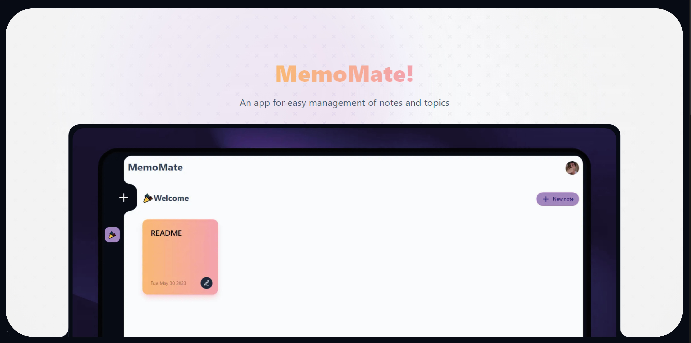

<h1 align="center">
  MemoMate Notetaker 📚
</h1>


<div align="center">

<a href="https://memomate-note.vercel.app">

</a>

<p></p>

<span>&nbsp;&nbsp;•&nbsp;&nbsp;</span>
<a href="#-getting-started">🤝 Contribute</a>
<span>&nbsp;&nbsp;•&nbsp;&nbsp;</span>
<a href="https://twitter.com/ZevaGuillo">🤘 Twitter</a>

</div>

## Features

- Login with Google and GitHub
- Create, Edit, and Delete Topics
- Create, Edit, and Delete Notes
- Markdown Support


## Local setup

Clone the repository:

```bash
git clone git@github.com:YOU_USER/slug.git
```

Install dependencies:

```bash
pnpm install
```

Create Your .env File
```bash
DATABASE_URL=

NEXTAUTH_SECRET=""
NEXTAUTH_URL="http://localhost:3000"

GITHUB_CLIENT_ID=
GITHUB_CLIENT_SECRET=
GOOGLE_CLIENT_ID=
GOOGLE_CLIENT_SECRET=
```

Push your DB to Supabase:
```bash
pnpx prisma db push
```

Run
```bash
pnpm run dev
```

## Tech Stack
This project is built with [create-t3-app](https://github.com/t3-oss/create-t3-app)
- [Next.js](https://nextjs.org/)
- [React](https://reactjs.org/)
- [tRPC](https://trpc.io/)
- [Prisma](https://www.prisma.io/)
- [Supabase](https://supabase.com/)
- [Tailwind](https://tailwindcss.com/)


## Authors

- [@ZevaGuillo](https://github.com/ZevaGuillo)

## License

[MIT](https://choosealicense.com/licenses/mit/)
